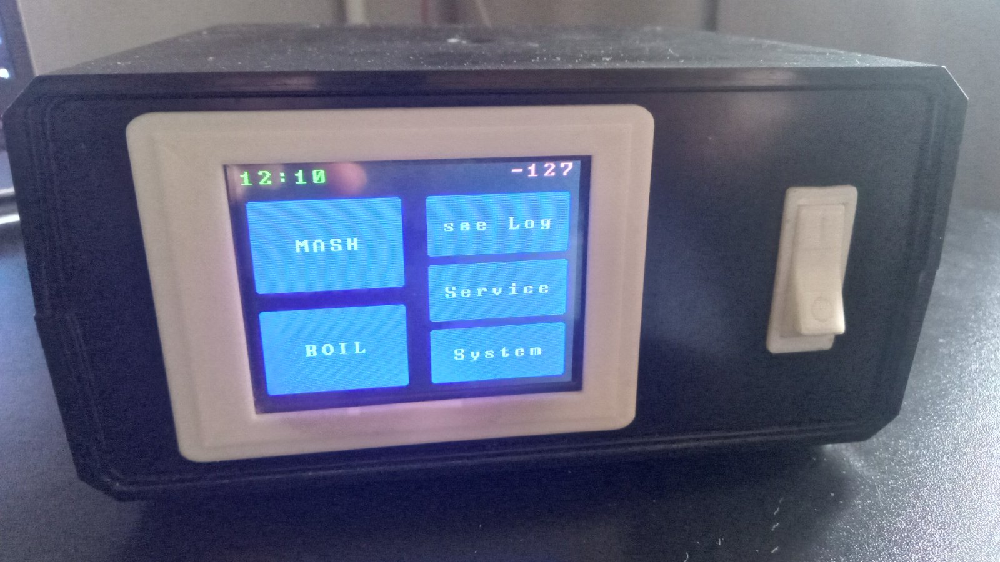
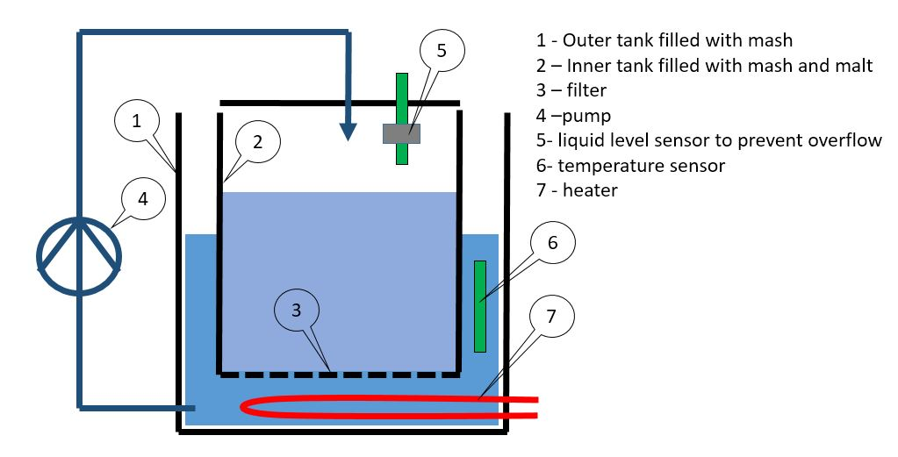
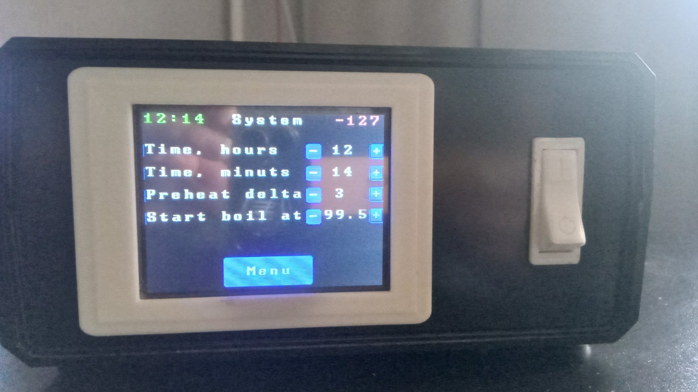
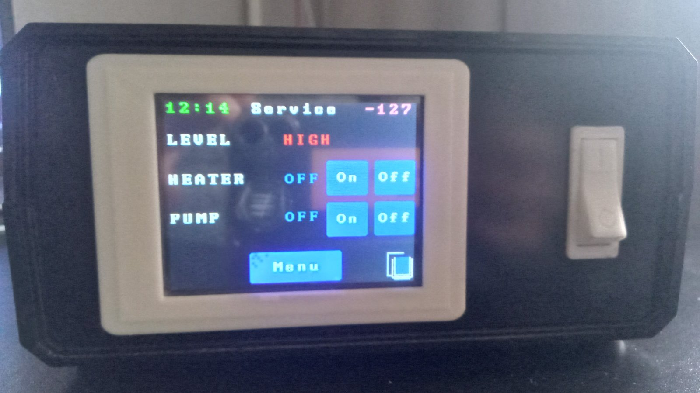
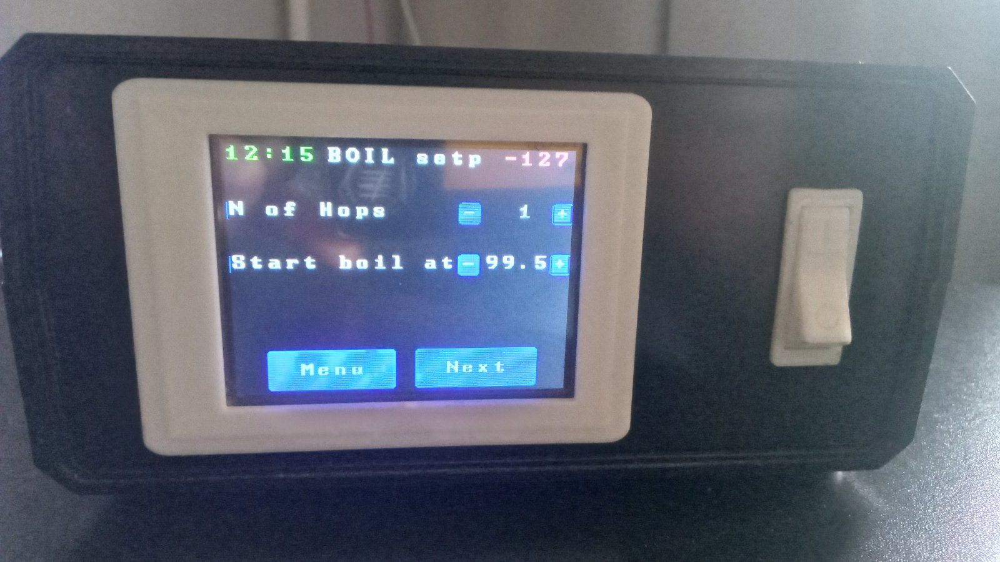
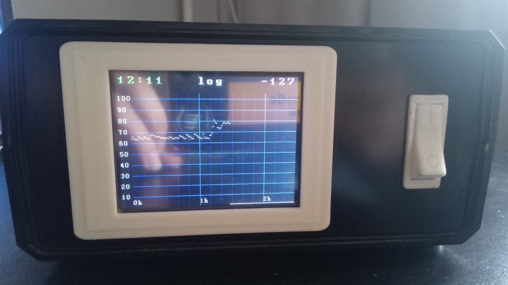

# Brewery_automation

Control unit for home brewery 

### Control unit hardware:
* Arduino Mega 2560 V3.
* TFT LCD Mega shield V2.2.
* TFT_320QVT 320x240 LCD screen which uses SSD1289 IC driver and XPT2046 touch screen controller. 
* DS3231 Realtime clock module.
* Solid state relay SSR-40 with heat sink for comutating heater
* 1 Channel 5V Relay Module for comutating pump
* buzzer
* Power supply unit 230AC-5DC 1A
* Power line filter for power supply line
* Power line filter for pump supply line
* Power swith
* Connectors

### Peripheral sensors:
* temperature sensor DS1820
* reed switch liquid level censors

### Pereferial devises:
* heater 230V, 2kWt
* Food grade high teperature magnetic drive pump 230V, 10W

### Unit scheme

## Usage
Remark -  in the top rigth corner of the screen you can see "-127", it is because temperature sensor was not connected during making photos. In usual situation there will be real temperautre of the mash.

### System settings

Here you can set up current time, Mashing preheat delte and boiling temperature

### Service mode

You can manualy manage Pereferial hardvare here

### Mashing
1. Fill tank with watter
2. in menu "Mash" Set temperature profile(temperatures and durations)
3. Push "Next", watter preheting will start
4. As soon as system inform start temperature reached it invites you to add malt and touch screet for starting mashing process
5. System warns about finishing of mash process, you can proceed with Boiling.

### Boiling

1. in the "Boil" menu choose how many hop portions will be used, and adjust star boiling temperature if needed
2. On the next screen choose time for adding hop for every portion.

### Log

history of last mashing temperature changes can be seen on log screen

------------

## Notes about software

1. By default UTFT_Buttons.h library support 20 buttons, but I use more. For proper work open UTFT_Buttons.h file and change string " #define MAX_BUTTONS	20 " to " #define MAX_BUTTONS	26
2. In case of short time power failure system will resume operation from the last state before power outage. To prevent loss of data about system state I use DS3231 Realtime clock (RTC) module memory because it has backup battery. I wrote custom libriary https://github.com/DmytroY/RWI2C to operate with RTC memory via I2C bus. You shoul connect that libriary before compilling **dimas_brewery.ino** program.
