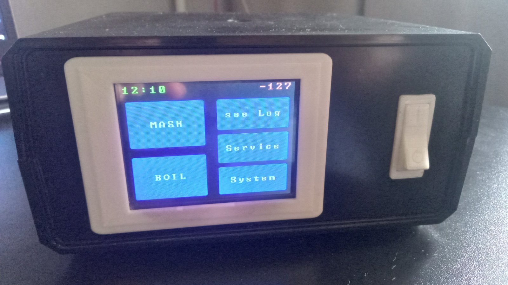
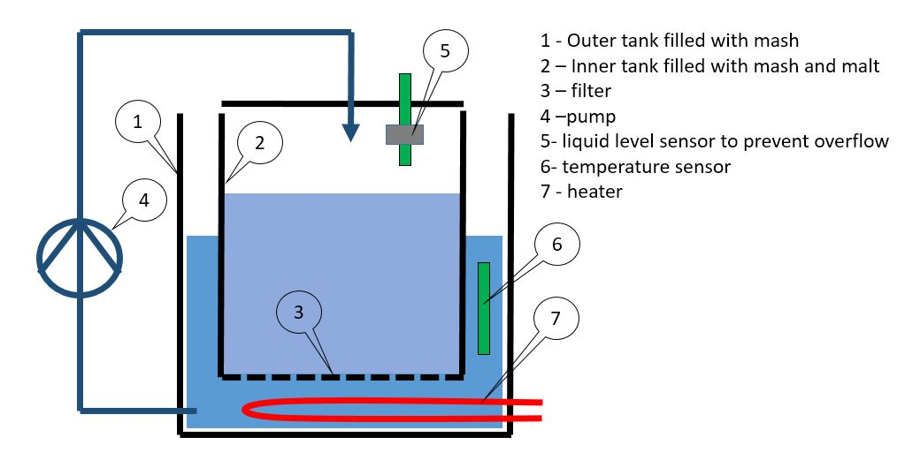
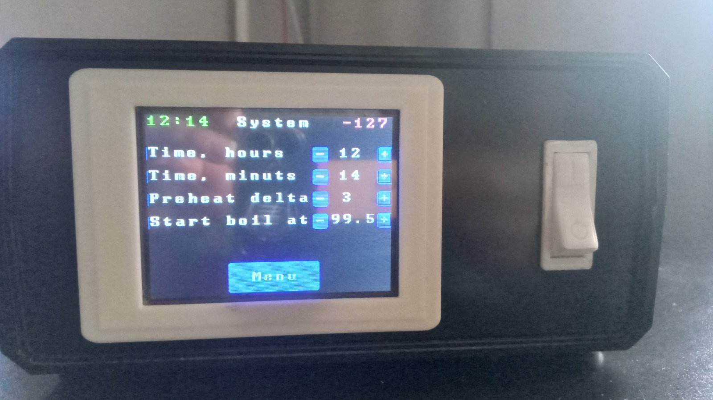
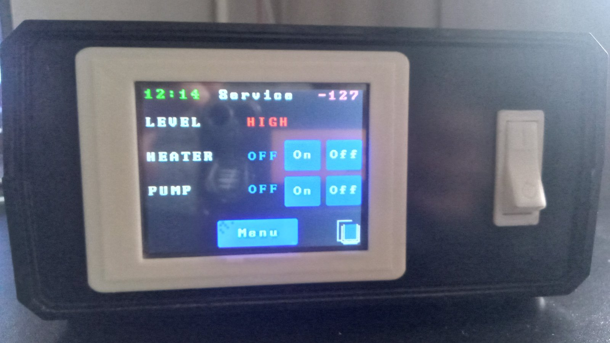
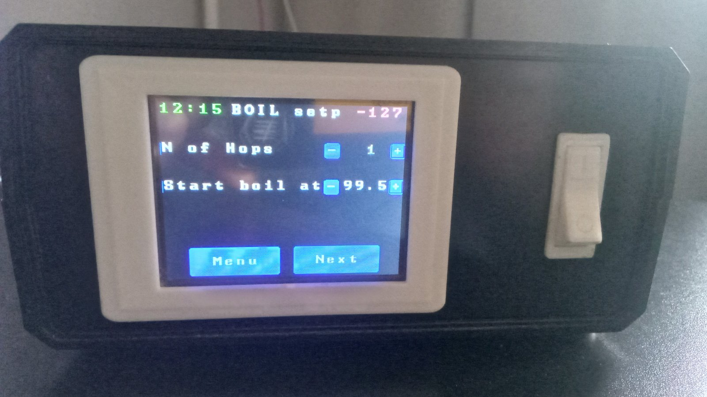
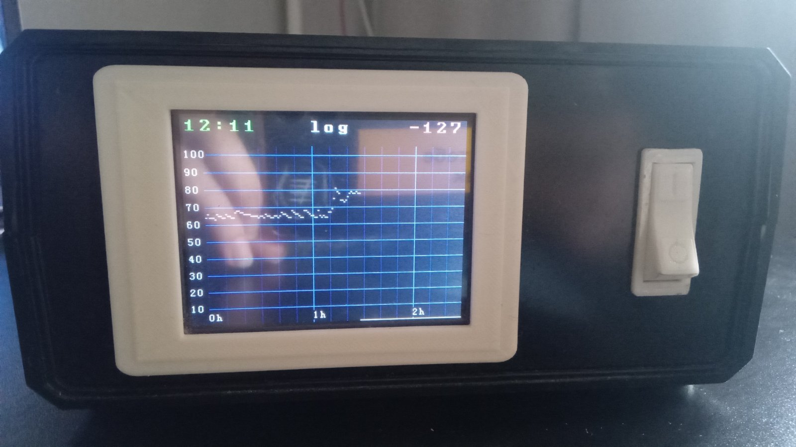

# Home Brewery Automation

Arduino Mega 2560 firmware for a small home-brewing system with a 3.2-inch resistive touchscreen interface. The controller automates mash temperature rests and boiling, switches a heater and recirculation pump, records mash temperatures, and can resume an interrupted process after a power outage.

> **Status:** This is a hobbyist hardware and firmware project. It controls mains-powered equipment. Build, test, and operate it only if you understand the electrical and brewing risks involved. Use appropriate isolation, fusing, grounding, enclosures, emergency shutoffs, and temperature/level protections.



## Features

- Touchscreen main menu for **Mashing**, **Boiling**, **Service**, **System**, and **Log** modes.
- Configurable mash schedule with up to six temperature rests and durations.
- Automatic preheating, temperature control, and pump operation during mashing.
- Configurable boil temperature and up to five hop additions.
- Adjustable heater power during boiling.
- DS18B20/DS1820 1-Wire temperature measurement.
- Liquid-level monitoring that prevents pump operation when the upper level is reached.
- Audible prompts when malt or hops should be added and when a process completes.
- DS3231 real-time clock for timing, timestamping, and recovery after a power interruption.
- Temperature logging during mashing, viewable as a graph on the controller.
- Service screen for manually testing the heater and pump.
- Settings stored in EEPROM and RTC registers so a mash or boil can continue after a short power outage.

## Hardware

### Controller and interface

- Arduino Mega 2560 Rev3
- TFT LCD Mega Shield V2.2
- TFT_320QVT 320×240 display with an SSD1289 controller
- XPT2046 resistive touchscreen controller
- DS3231 real-time clock module
- Buzzer
- 5 V power supply
- Power switches, connectors, and line filters as required by the build

### Sensors and outputs

- DS18x20/DS1820 temperature sensor
- Reed-switch liquid-level sensor
- SSR-40 solid-state relay with heatsink for the heater
- Single-channel 5 V relay module for the pump
- 230 V, 2 kW heater
- Food-grade, high-temperature magnetic-drive pump, 230 V, 10 W



## Control pin map

The current sketch uses the following Arduino Mega pins:

| Function | Pin |
| --- | --- |
| Temperature sensor | A1 |
| Upper liquid-level sensor | A3 |
| Heater control | 13 |
| Pump control | A5 |
| Buzzer | A6 |
| TFT display | 38, 39, 40, 41 |
| Touchscreen | 6, 5, 4, 3, 2 |
| DS3231 / I2C device | SDA / SCL |

Verify the pin assignments and relay logic against your own wiring before connecting the controller to a load.

## User interface

### System settings

Set the clock, the mash preheat delta, and the target temperature at which boiling starts.



### Service mode

Manually inspect the liquid-level state and switch the heater or pump for commissioning and troubleshooting. Outputs are disabled when returning to the main menu.



### Mashing

1. Fill the vessel with water.
2. Open **Mash** and configure the number of rests, target temperatures, durations, and preheat delta.
3. Select **Next** to begin preheating.
4. When the start temperature is reached, add the malt and tap the touchscreen.
5. The controller runs each rest, controls the heater and pump, and records the mash temperature.
6. When mashing is complete, continue to boiling or return to the menu.

### Boiling

1. Open **Boil** and configure the number of hop additions and the boiling start temperature.
2. Set the addition time for each hop portion and the total boil duration.
3. Start the boil. The controller regulates heater duty during the boil and pauses for confirmation when a hop addition is due.
4. Tap the screen after adding each hop so the schedule can continue.



### Temperature log

The **Log** screen displays the temperature history recorded during the mash.



## Software requirements

The sketch is written for the Arduino IDE and depends on these libraries:

- [UTFT](https://github.com/SMFSW/UTFT)
- [URTouch](https://github.com/SMFSW/URTouch)
- `UTFT_Buttons`
- [OneWire](https://github.com/PaulStoffregen/OneWire)
- [DallasTemperature](https://github.com/milesburton/Arduino-Temperature-Control-Library)
- `DS3231`
- `RWI2C` ([project repository](https://github.com/DmytroY/RWI2C))

The bundled `dimas_brewery.ino` sketch also uses the Arduino `EEPROM` library.

### `UTFT_Buttons` configuration

The sketch creates more than the library's default 20 buttons. Before compiling, edit `UTFT_Buttons.h` and increase the limit:

```cpp
#define MAX_BUTTONS 26
```

### Uploading

1. Install the Arduino IDE and the required libraries.
2. Open `dimas_brewery.ino`.
3. Select **Arduino Mega or Mega 2560** and the correct serial port.
4. Confirm the display, touchscreen, sensor, RTC, level sensor, heater relay, pump relay, and buzzer wiring.
5. Upload the sketch with the power stage disconnected or otherwise made safe.
6. Use **Service** mode to verify sensor readings and outputs before brewing.

The sketch initializes default mash and boil values in EEPROM when it detects an uninitialized board. Existing settings may be preserved across resets and uploads.

## Repository layout

```text
.
├── dimas_brewery.ino   # Arduino Mega firmware
├── Pictures/           # Screenshots and hardware diagram
└── README.md           # Project documentation
```

## Known limitations

- The firmware targets the specific display, touchscreen, relay arrangement, and wiring described above; it is not a generic brewery controller.
- The current sketch is a single `.ino` file and does not include a formal automated test suite.
- Temperature and level-sensor behavior should be validated with the actual vessel and wiring before using a live brew.
- Mains switching and heater control require appropriate hardware safety measures beyond the firmware.

## License

No license file is currently included. Unless a license is added, the repository is not licensed for redistribution or reuse beyond the permissions provided by GitHub.
